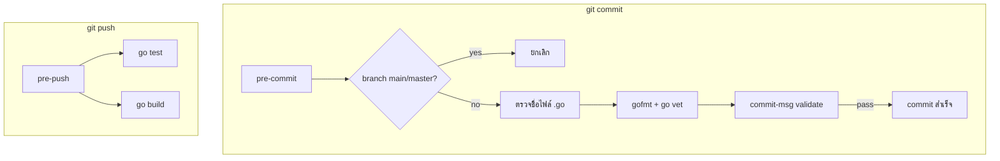

# template-ts-vue3

Go project template พร้อม Git Hook ([Lefthook](https://github.com/evilmartians/lefthook)) สำหรับ code quality และ team policy — config อยู่ใน `lefthook.yml` ไฟล์เดียว ไม่ต้องมี script แยก

## Prerequisites

- Go 1.22+
- [Lefthook](https://github.com/evilmartians/lefthook) v1.6.0+

```sh
# ติดตั้ง lefthook (เลือกวิธีใดวิธีหนึ่ง)
brew install lefthook
# หรือ
go install github.com/evilmartians/lefthook/v2@latest
```

## Project Setup

### 1) Clone โปรเจกต์

```sh
git clone <repo-url>
cd template-ts-vue3
go mod download
```

### 2) ลงทะเบียน Git Hook

```sh
lefthook install
```

### 3) ทดสอบว่า hook ทำงาน

```sh
lefthook run pre-commit
lefthook run commit-msg .git/COMMIT_EDITMSG
lefthook run pre-push
```

### รันแอป

```sh
go run ./cmd
```

---

## Git Hook + Lefthook

### Hooks ทั้งหมด



### pre-commit

| ลำดับ | Hook | ตรวจอะไร |
| ----- | ---- | -------- |
| 1 | `check-branch` | ห้าม commit ตรง `main` / `master` |
| 2 | `check-file-names` | ไฟล์ `.go` ต้องเป็น snake_case (เช่น `user_service.go`) |
| 3 | `go-lint-and-fmt` | `gofmt` + `go vet ./...` (รันเมื่อมีไฟล์ `.go` ใน staging) |

### commit-msg — Conventional Commits

```
feat(hooks): add lefthook config
fix(cmd): resolve undefined variable
chore: update go.mod
```

กฎ:

- รูปแบบ: `<type>(<scope>): <description>` — scope ใส่หรือไม่ใส่ก็ได้
- type ที่อนุญาต: `feat`, `fix`, `docs`, `style`, `refactor`, `perf`, `test`, `chore`, `build`, `ci`

### pre-push

| Hook | ตรวจอะไร |
| ---- | -------- |
| `go-test` | รัน `go test -v ./...` |
| `go-build` | รัน `go build` เพื่อยืนยันว่า compile ผ่าน |

> `go-test` และ `go-build` รันแบบ parallel

### Team Policy

| กฎ | Hook | ผลลัพธ์เมื่อฝ่าฝืน |
| --- | ---- | ------------------- |
| ห้าม commit ตรง main/master | pre-commit | commit ถูกยกเลิก |
| บังคับ snake_case สำหรับไฟล์ Go | pre-commit | commit ถูกยกเลิก |
| บังคับ commit message format | commit-msg | commit ถูกยกเลิก |
| ห้าม push โค้ดที่ test/build ไม่ผ่าน | pre-push | push ถูกยกเลิก |

### IDE-friendly output

ตั้งค่าใน `lefthook.yml` เพื่อให้อ่าน error ใน Cursor/VS Code Git dialog ได้ชัดเจน:

```yaml
colors: false   # ปิด ANSI color codes
no_tty: true     # ปิด spinner / interactive UI
output: false    # แสดงเฉพาะ error จาก hook ไม่แสดงกรอบ summary
```

ข้อความ error จาก hook จะพิมพ์ไปที่ `stderr` พร้อมหัวข้อที่อ่านง่าย เช่น `❌ Go vet failed — please fix the errors below:`

---

## นำไปใช้กับโปรเจกต์ Go อื่น

ไฟล์ที่ต้อง copy:

```
your-go-project/
├── lefthook.yml
├── go.mod
└── cmd/
    └── main.go
```

ขั้นตอนติดตั้ง:

```sh
cd your-go-project
brew install lefthook    # ครั้งเดียวบนเครื่อง
lefthook install
lefthook run pre-commit  # ทดสอบ
```

สิ่งที่ควรปรับก่อนใช้งานจริง:

| ไฟล์ | ปรับอะไร |
| --- | --- |
| `lefthook.yml` → `check-branch` | รายชื่อ branch ที่ห้าม commit ตรง |
| `lefthook.yml` → `validate-msg` | pattern ของ Conventional Commits |
| `lefthook.yml` → `pre-push` | เพิ่ม/ลดขั้นตอน test, lint, secret scan |

> โฟลเดอร์ Go ต้องไม่ขึ้นต้นด้วย `_` (เช่น ใช้ `cmd/` ไม่ใช่ `_cmd/`) เพราะ `go vet ./...` จะไม่เห็น package

หลัง commit ไฟล์ hook ขึ้น repo แล้ว สมาชิกทีมที่ clone มาใหม่รันแค่:

```sh
lefthook install
```

---

## คำสั่งที่ใช้บ่อย

```sh
lefthook run pre-commit
lefthook run pre-push
go vet ./...
go test ./...
go build ./...
```

### ข้าม hook (ฉุกเฉิน)

```sh
git commit --no-verify -m "hotfix: emergency patch"
git push --no-verify
LEFTHOOK=0 git commit -m "wip: draft"
```

### ไฟล์ที่เกี่ยวข้อง

```
lefthook.yml    # config หลักของ hook (จำเป็น)
go.mod          # Go module
cmd/            # entry point ของแอป
```